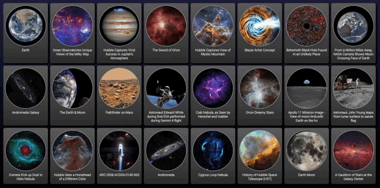

# React Learning App

I am currently learning React and built this app to test out what I've learned so far.
This app takes the most popular images from the [NASA Images](https://images.nasa.gov/) site and displays them.
Clicking on an image card will open up the record on the NASA Images site.

